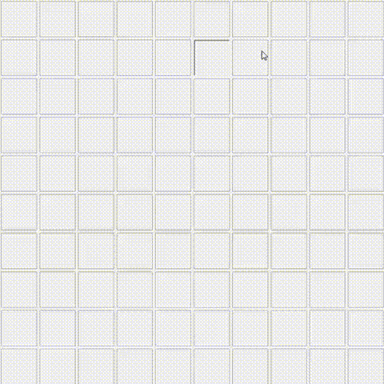

# Gomoku Python Game

## Overview
This repository contains a Python-based Gomoku game developed using object-oriented programming principles and a layered architecture. The game features both a text-based UI and a graphical user interface (GUI) built with Tkinter. The game allows the player to compete against a computer AI, with strategic moves and win-checking logic. 

### Key Features:
- **Graphical Interface:** The game has a GUI with interactive buttons that display the game state.
- **Command-Line Interface:** Users can play using the terminal for a minimal experience.
- **Computer AI:** A built-in AI opponent that makes strategic moves and blocks the player when necessary.
- **Input Validation:** The game includes safeguards against invalid user input.
- **Layered Architecture:** The project follows a clean separation of concerns between the board, services, and UI layers.
- **Unit Testing:** All modules (excluding the UI) come with unit tests to ensure reliability and proper functionality.

## Installation

To run the project, ensure you have Python 3.x installed. Clone this repository and navigate into the project folder.

```bash
git clone https://github.com/Chris91ss/Gomoku-Python-OOP-Game.git
cd Gomoku-Python-OOP-Game
```

## Running the Game

### Running the GUI Version:
To play the game using the GUI, run the following command:

```bash
python3 start.py
```

### Running the Command-Line Version:
To play the game in the terminal, run:

```bash
python3 start.py --ui
```

## Project Structure

```plaintext
├── src
│   ├── domain
│   │   ├── board.py         # Board representation and operations
│   │   ├── player.py        # Player class definition
│   │   ├── computer_player.py # AI opponent logic
│   ├── services
│   │   ├── game_service.py   # Game logic, including move validation and winner checks
│   ├── repository
│   │   ├── board_repository.py # Board repository to store and retrieve game states
│   ├── ui
│   │   ├── ui.py            # Command-line UI
│   ├── gui
│   │   ├── gui.py           # Tkinter-based graphical user interface
│   ├── tests
│   │   ├── tests.py         # Unit tests for game services
├── start.py                 # Entry point for the game
├── gif                      # Folder for gameplay demonstration GIFs
```

## Code Overview

The game is structured using object-oriented programming and is divided into several layers: domain, services, UI, and repository. Here's an overview of the key modules, along with some code snippets to highlight the structure.

### 1. **Board (`board.py`):**
This module defines the board class that represents the game grid. It includes functions for placing pieces, checking if a cell is empty, and displaying the board in the terminal.

```python
class Board:
    def __init__(self, size):
        self.size = size
        self.grid = [['-' for _ in range(size)] for _ in range(size)]

    def is_empty(self, row, col):
        return self.grid[row][col] == '-'

    def place_piece(self, row, col, piece):
        self.grid[row][col] = piece

    def display(self):
        for row in self.grid:
            print(" | ".join(row))
```

### 2. **Player (`player.py`) and Computer AI (`computer_player.py`):**
The player class defines the basic player structure, while the `ComputerPlayer` class inherits from it to implement AI behavior. The AI strategically places pieces and attempts to block or win against the human player.

```python
class Player:
    def __init__(self, name, piece=None):
        self.name = name
        self.piece = piece

class ComputerPlayer(Player):
    def get_move(self, board):
        # AI logic to block player or make a strategic move
        return self.find_winning_or_blocking_move(board)
```

### 3. **Game Service (`game_service.py`):**
This layer handles the main game logic, including move validation, game state management, winner detection, and interactions between the player and the board.

```python
class GameService:
    def __init__(self, size):
        self.board = Board(size)
        self.player = Player("Player", "X")
        self.computer_player = ComputerPlayer("Computer", "O")

    def make_move(self, row, col):
        if self.board.is_empty(row, col):
            self.board.place_piece(row, col, self.player.piece)
            return True
        return False

    def make_computer_move(self):
        move = self.computer_player.get_move(self.board)
        self.board.place_piece(*move, self.computer_player.piece)
```

### 4. **UI (`ui.py`) and GUI (`gui.py`):**
- **UI:** The command-line interface allows the user to play the game by entering coordinates for their moves.
- **GUI:** A graphical user interface (GUI) built with Tkinter provides buttons for users to click and play, visually updating the game board.

```python
class GomokuGUI:
    def __init__(self, size):
        self.root = tk.Tk()
        self.game_service = GameService(size)
        self.create_board_buttons()

    def create_board_buttons(self):
        for i in range(len(self.buttons)):
            for j in range(len(self.buttons[i])):
                button = tk.Button(self.root, command=lambda row=i, col=j: self.make_move(row, col))
                button.grid(row=i, column=j)
```

### 5. **Repository (`board_repository.py`):**
The board repository is responsible for saving and loading the game state during the gameplay.

```python
class BoardRepository:
    def save_board(self, board):
        self.board = board

    def load_board(self):
        return self.board
```

### 6. **Tests (`tests.py`):**
Unit tests are provided to ensure the game's functionality. The game logic (excluding the UI) is covered by these tests.

```python
import unittest
from src.services.game_service import GameService

class TestGameService(unittest.TestCase):
    def test_make_move(self):
        game_service = GameService(10)
        game_service.make_move(0, 0)
        self.assertEqual(game_service.board.grid[0][0], 'X')
```

---

## Game Rules

- Gomoku is a strategy board game where two players (one human and one computer) take turns placing their pieces (X for the player, O for the computer) on a 10x10 grid.
- The first player to align five consecutive pieces horizontally, vertically, or diagonally wins.
- The game will detect and announce the winner or declare a tie if the board is full without a winner.

## How the AI Works

The computer player employs the following strategies:
1. **Winning Move Detection:** The AI checks for any available move to win.
2. **Blocking Move Detection:** The AI looks for potential player wins and blocks them.
3. **Strategic Move:** The AI places its piece next to existing ones to form future winning opportunities.

## Unit Testing

The game logic is covered by unit tests using PyUnit. Run the tests with the following command:

```bash
python3 -m unittest discover
```

## Gameplay Demonstration

Below are some gameplay demonstrations showcasing the game in both GUI and command-line interfaces. [Add your GIFs to the `gif/` folder and reference them here.]

### GUI Version:


### Command-Line Version:


## Contributing

Pull requests are welcome. For major changes, please open an issue first to discuss what you would like to change.

## License

This project is licensed under the MIT License.
